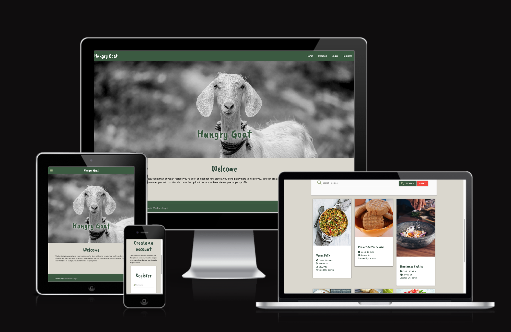
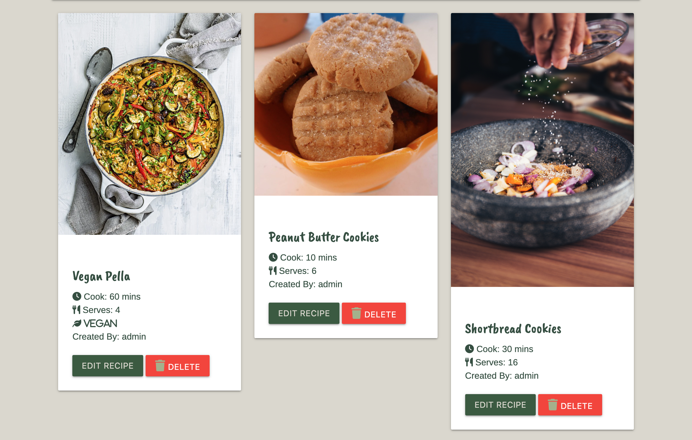
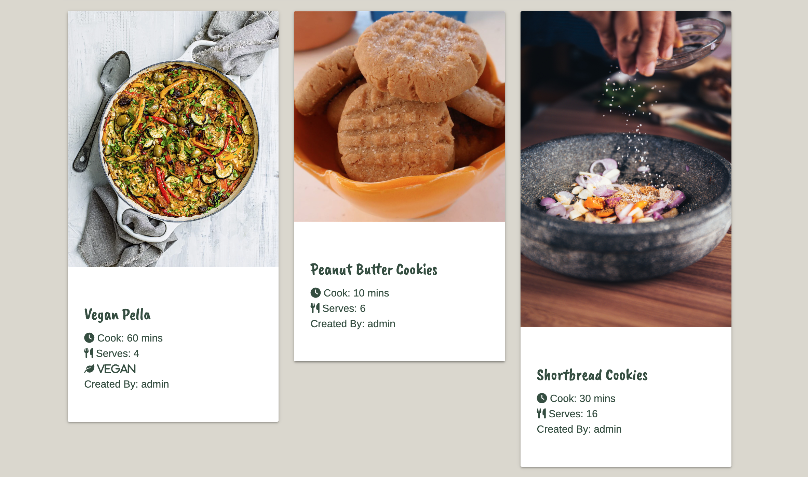
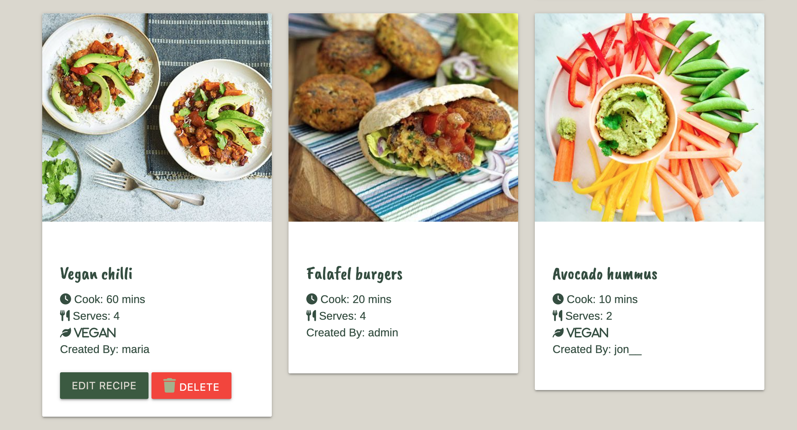
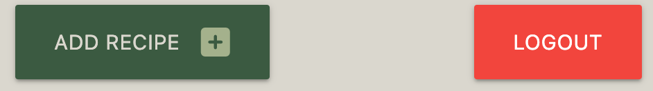

# **Ηungry Goat - by Maria Markou-Inglis** 
## **Project overview**
‘Hungry Goat’ is an online recipe cookbook where everyone can find vegan and veggie recipes. Users have the option to create an account where they can save their favourite recipes and also share their favourite recipes with everyone.

The site is created to promote a healthy diet and promote healthy meat alternatives/

I have used HTML, CSS, JavaScript and Python to build the site, ensuring that it is fully responsive to user interaction on their chosen device 

## **Deployed Site**

The live website can be found a the following link; [Hungry Goat](https://hungry-goat.herokuapp.com/)
 

***

## **Project Goals**
---
- Create a web application where users can create, store and easily access recipes
- Build a website that is responsive on all devices
- Display information in a user-friendly way, contributing to an overall good user experience

***
## **UX Design**
---
## **Strategy Plan**
 

- ### **Site Owner Goals** 
  - Share Vegetarian and Vegan recipes
  - Promote a healthy and balanced diet with vegetarian meals
  - Encourage users to create an account
  - Encourage users to share their recipes

- ### **User Stories** 
  
    - **First-time User**
      - Be able to understand the purpose of the site easily
      - Be able to easily navigate throughout the site
      - Experience good responsive design and access the site from different devices
      - Access recipes without having to create an account
      - Access a variety of veggie & vegan recipes for different meals of the day
      - Be able to filter the recipes using ingredients and recipe title
      - Have the option to register an account
    - **Returing User**
      - Be able to login to their account
      - Share their own recipes
      - Find the recipes they have shared on their profile page
      - Edit the recipes they have added 
      - Delete the recipes they have added
    - **Admin**
      - Be able to add new recipes.
      - Be able to edit recipes created by ant user
      - Be able to to delete existing recipes created by any user.

## **Scope Plan**
 

### **Existing Features** 

1. **Design**
   - Simple layout and design that is consisntent throught the website
2. **Navigation**
   - Users can easily navigate, using the navigation bar located on the top of the page. 
   - Different links appear depending on the user that is logged in
   - Collapsable navigation bar appears on the left side on smaller screens 
3. **Recipes**
   - Users can create, read, update and delete (CRUD) recipes
   - Users can access the recipes without having to create or login to their account
   - Users can search recipes by recipe title and ingredients
   - Logged-in users can share their own recipes
   - Logged-in users can view their own recipes on their profile page
   - Recipe information includes servings, cook times, category, ingredients and the method and whether it is vegan or not.
4. **Register, Login and Logout**
   - Users can create an account.
   - Users can login into their account.
   - Users can logout of their account.

5. **Defensive Programming**
   - **Button Display**
     - Certain action buttons and links are only displayed to certain users. For example "Manage Categories" is only displayed to "admin" user.
   - **Python functions**
      - **Check user is logged in:** For example the add_recipe function only allows you to submit a recipe if you are logged in. If a user is not logged in, it redirects you to the login page with a message saying that you have to log in to add a recipe
      - **Check username:** Functions like edit or delete recipe check that your username matched to the user that created the recipe. As you cannot edit or delete recipes created by other users a flash message will appear that says you are not authorised
      - **Check if username == admin** Functions check if the user is admin and allow to create, edit or delete all recipes and categories
### **Future Features** 
1. **Favourite Recipes:** Users can save their favourite recipes. Recipes will be displayed on their profile
2. **Rate a Recipe:** Users can rate recipes
3. **Comment on Recipes:** Users can leave comments on recipes
4. **Account Setting:** Users can change their password and delete their account
5. **Contact Form:** Users can contact admin with questions and queries
***
## **Structure Plane**
***
The structure of the site has been developed to enable users to access and use the site with ease.

- **Home Page:** The home page is accesible to all users, whether logged-in or not
- **Navbar:** The navigation bar is accessible to all users. The navbar changes to a sidenav on smaller screens for responsiveness. The options available in the navbar change depending on whether a user is logged in or not.
   - For logged in users: 
   - For admin user: 
   - For not logged in users: 
- **Recipes:** The recipe page is accessible to all users, whether logged in or not.
   - Recipe cards display a delete and edit button if the user is authorised to edit or delete. When you are logged in you can edit your own recipes. Admin user can edit and delete all recipes
      - Card display when admin is logged in 
      - Card display when user is not logged in 
      - Card display when user maria is logged in 
- **Profile:** Profile page is only accesible if the user is logged in. On the Profile page users can find a "Add Recipe" button and a "Logout" button 
All recipes shared by the logged in user are displayed on their profile page. The user can edit and delete their own recipes from their profile
- 
***
## **Skeleton Plane**
***
### **Wireframes**
- [Home Page]()
- [Recipes Page]()
- [Login Page]()
- [Register Page]()
- [Add Recipe]()
- [Edit Recipe]()
- [User Profile]()
  
***

## **Surface Plane**
***
### **Colour Scheme**

[Coolors](https://coolors.co/) was used to create the palette.

As the website is created to share plant-based recipes, the colour scheme is green.
### **Images**
### **Design**
### **Typography**

***
## **Technologies**
***
### **Languages and Libraries**
- [HTML5](https://en.wikipedia.org/wiki/HTML5)
- [CSS3]()
- [JavaScript]()
- [Python]()
- [Flask]()
- [Font Awesome]()
- [Google Fonts]()
- [Materialize]()
  
### **IDE and Version Control**
- [Git](https://git-scm.com/) was used for version control
- [GitHub](https://github.com/) used for storing the project.
- [GitPod](https://www.gitpod.io/) was used for editing code.
- [Code Institute Template](https://github.com/Code-Institute-Org/gitpod-full-template) provided GitPod extensions.
### **Design and Development**
- [Balsamiq](https://balsamiq.com/) was used to create wireframes
- [Lucid](https://lucid.app/) was used to create database schema diagram
- [Adobe Photoshop](https://www.adobe.com/uk/) was used to edit the hero image
- [Favicon](https://favicon.io/) was used to create a favicon for the site.

### **Validating and Testing**

***

## **Testing**
Testing section for this project can be found [here](testing.md)

***
## **Deployment**
***

## **Credits**

   # **Code**
   - Code for submiting ingredients and method steps when adding a recipe from [Wanderlust Recipes](https://github.com/RussOakham/wanderlust-recipes)
   
   # **Images**
   - Hero Image [Nandhu Kumar](https://www.pexels.com/@nandhukumar/) from [pexels.com](https://www.pexels.com/photo/selective-focus-photography-of-goat-1011630/)