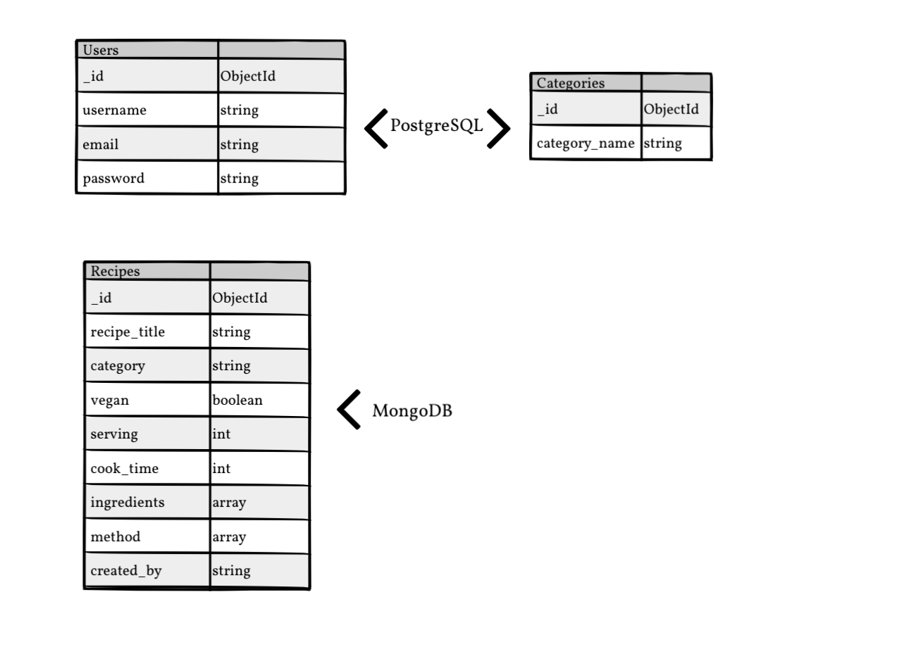

# **Ηungry Goat - by Maria Markou-Inglis** 
## **Project overview**
‘Hungry Goat’ is an online recipe cookbook where users can find vegan and vegetarian recipes. Users have the option to create an account where they can share their favorite recipes with others.

The site was created to promote a healthy diet and meat alternatives. I was inspired by the [HappyCow](https://www.happycow.net/) app that helps you find vegetarian and vegan restaurants near you.

I have used HTML, CSS, JavaScript and Python to build the site, ensuring that it is fully responsive to user interaction on their chosen device.

## **Deployed Site**

The live website can be found a the following link; [Hungry Goat](https://hungry-goat.herokuapp.com/)
 

## **Project Goals**
- Create a web application where users can create, store, and easily access recipes.
- Build a website that is responsive on all devices.
- Display information in a user-friendly way, contributing to an overall good user experience.

## **UX Design**
## **Strategy Plan**
 

- ### **Site Owner Goals** 
  - Share Vegetarian and Vegan recipes.
  - Promote a healthy and balanced diet with vegetarian meals.
  - Encourage users to create an account.
  - Encourage users to share their recipes.

- ### **User Stories** 
  
    - **First-time User**
      - Be able to understand the purpose of the site easily.
      - Be able to easily navigate the site.
      - Experience good responsive design when accessing the site from different devices.
      - Access recipes without having to create an account.
      - Access a variety of vegetarian & vegan recipes for different meals of the day.
      - Be able to filter the recipes by ingredients and recipe title.
      - Have the option to register an account.
    - **Returning User**
      - Be able to login to their account.
      - Share their own recipes.
      - Find the recipes they have shared on their profile page.
      - Edit the recipes they have added.
      - Delete the recipes they have added.
    - **Admin**
      - Be able to add new recipes.
      - Be able to edit recipes created by users.
      - Be able to to delete existing recipes created by users.

## **Scope Plan**
 

### **Existing Features** 

1. **Design**
   - Simple layout and design that is consistent throughout the website.
2. **Navigation**
   - Users can easily navigate using the navigation bar located at the top of the page. 
   - Different links appear depending on the user that is logged in.
   - Collapsible navigation bar that appears on the left side on smaller screens.
3. **Recipes**
   - Users can create, read, update and delete (CRUD) recipes.
   - Users can access the recipes without having to create or login to their account.
   - Users can search recipes by recipe title and ingredient.
   - Logged-in users can share their own recipes.
   - Logged-in users can view their own recipes on their profile page.
   - Recipe information includes servings, cook times, category, ingredients, the method, and whether it is vegan or not.
4. **Register, Login, and Logout**
   - Users can create an account.
   - Users can login into their account.
   - Users can logout of their account.

5. **Defensive Programming**
   - **Button Display**
     - Certain action buttons and links are only displayed to certain users. For example, "Manage Categories" is only displayed to the "admin" user.
   - **Python functions**
      - **Check user is logged in:** For example, the add_recipe function only allows you to submit a recipe if you are logged in. If a user is not logged in, it redirects you to the login page with a message saying that you have to log in to add a recipe.
      - **Check username:** Functions like edit or delete recipe check that your username matched to the user that created the recipe. As you cannot edit or delete recipes created by other users, a flash message will appear that says you are not authorised.
      - **Check if username == admin:** Functions check if the user is admin and allow to create, edit or delete all recipes and categories.
### **Future Features** 
1. **Favorite Recipes:** Users can save their favorite recipes. Recipes will be displayed on their profile.
2. **Rate a Recipe:** Users can rate recipes.
3. **Comment on Recipes:** Users can leave comments on recipes.
4. **Account Setting:** Users can change their password and delete their account.
5. **Contact Form:** Users can contact admin with questions and queries.
## **Structure Plane**

The structure of the site has been developed to enable users to access and use the site with ease.

- **Home Page:** The home page is accessible to all users whether logged-in or not.
- **Navbar:** The navigation bar is accessible to all users. The navbar changes to a sidenav on smaller screens for responsiveness. The options available in the navbar change depending on whether a user is logged in or not.
   - For logged in users: 
   - For admin user: 
   - For not logged in users: 
- **Recipes:** The recipe page is accessible to all users, whether logged in or not.
   - Recipe cards display a delete and edit button if the user is authorised to edit or delete. When you are logged in you can edit your own recipes. Admin user can edit and delete all recipes.
      - Card display when admin is logged in: 
      - Card display when user is not logged in: 
      - Card display when user maria is logged in: 
- **Profile:** Profile page is only accessible if the user is logged in. On the Profile page, users can find an "Add Recipe" button and a "Logout" button: 
All recipes shared by the logged in user are displayed on their profile page. The user can edit and delete their own recipes from their profile.

## **Skeleton Plane**
### **Wireframes**
- [Home Page](hungrygoat/static/images/readme/wireframes/welcome.png)
- [Recipes Page](hungrygoat/static/images/readme/wireframes/recipes.png)
- [Login Page](hungrygoat/static/images/readme/wireframes/login.png)
- [Register Page](hungrygoat/static/images/readme/wireframes/register.png)
- [Add Recipe](hungrygoat/static/images/readme/wireframes/add_recipe.png)
- [Edit Recipe](hungrygoat/static/images/readme/wireframes/edit_recipe.png)
- [User Profile](hungrygoat/static/images/readme/wireframes/profile.png)
- [Add and Edit Category](hungrygoat/static/images/readme/wireframes/add_cateogry.png)
- [Manage Categories](hungrygoat/static/images/readme/wireframes/manage_cat.png)
### **Database Schema**

The data managed by PostgreSQL consists of the recipe categories and users. 

## **Surface Plane**
### **Colour Scheme**
[Colors](https://coolors.co/) was used to create the palette.
I chose to use a green palette for the website as the green colour is commonly associated with vegetarianism.

### **Typography**
[Google Fonts](https://fonts.google.com/) was used to choose fonts for the site. Caveat Brush chosen as the brand logo font and all titles on the site. Arimo was chosen for the rest of the site as it is clear and easy to read.

### **Images**

The [hero image](https://www.pexels.com/photo/selective-focus-photography-of-goat-1011630/) was sourced from [pexels](https://www.pexels.com/). When looking for the hero image on pexels I was looking for a goat to be the face of the site. The photograph was selected because the frame looks good on all screen sizes. I decided to use a black and white version of the photo as the greens on it did not match the green shades of the colour palette.

## **Technologies**
### **Languages and Libraries**
- [HTML5](https://en.wikipedia.org/wiki/HTML5) was used for structuring and presenting the content of the website.
- [CSS3](https://en.wikipedia.org/wiki/CSS) was used for the styling.
- [JavaScript](https://www.javascript.com/) was used to make the front end interactive.
- [Python](https://www.python.org/) was used for programming the application.
- [Flask](https://flask.palletsprojects.com/en/2.2.x/) was used to handle the templating throughout the site’s HTML pages.
- [Font Awesome](https://fontawesome.com/) was used to source the icons.
- [Google Fonts](https://fonts.google.com/) was used to source the fonts.
- [Materialize](https://materializecss.com/) was used for responsiveness and for the design of the application.
  
### **IDE and Version Control**
- [Git](https://git-scm.com/) was used for version control.
- [GitHub](https://github.com/) used for storing the project.
- [GitPod](https://www.gitpod.io/) was used for developing and editing the code.
- [Code Institute Template](https://github.com/Code-Institute-Org/gitpod-full-template) provided GitPod extensions.
### **Design and Development**
- [Heroku](https://id.heroku.com/login) was used for deployment of the application alongside Github. 
- [Balsamiq](https://balsamiq.com/) was used to create wireframes and database schema.
- [Adobe Photoshop](https://www.adobe.com/uk/) was used to edit the hero image.
- [Favicon](https://favicon.io/) was used to create a favicon for the site.
### **Validating and Testing**
- [Chrome](https://www.google.com/chrome/) was used to debug and test the source code, and to test the site's responsiveness.
- [W3C Markup](https://validator.w3.org/) was used for validating the html5 code.
- [CSS Validator](https://jigsaw.w3.org/css-validator/) was used for validating the CSS code.
- [JSHint](https://jshint.com/) was used for validating the javascript code.
- [Am I Responsive](https://ui.dev/amiresponsive) was used to generate the live site images and also used to test responsiveness.
- [PeP8 online](http://pep8online.com/) was used to check and prove pep8 compliance for models and routes.py files.

## **Testing**
Testing section for this project can be found [here](testing.md).

## **Deployment**
# **Deployment to Heroku**
 **Heroku was used to deploy this project. The steps used for deployment to Heroku are as follows:**

  1. Sign up and log into heroku.
  2. On the top right hand corner of the heroku website, click new, then create new app.
  3. Name the app, select region, and then click the create app button.
  4. Install postgres under the resources tab.
  5. Insert relevant config vars into heroku, such as IP, PORT SECRET_KEY, DATABAS_URL.
  6. You can click connect to github but this project used the CLI method.
  7. Log into heroku via CLI.
  8. Create a git remote for heroku.
  9. Push all changes to the staging area.
  10. Push to heroku for your app to run and function.
   

## **Credits**
   ### **Code**
   - [Materialize](https://materializecss.com/) used for styling and responsiveness throughout, including the recipe cards and forms. 
   - The code for submitting ingredients and method steps when adding a recipe is from [Wanderlust Recipes](https://github.com/RussOakham/wanderlust-recipes).
   - [Combining Databases](https://github.com/Code-Institute-Solutions/CombinedTaskManager2022) for connecting both databases to the app.
   
   ### **Images**
   - Hero Image [Nandhu Kumar](https://www.pexels.com/@nandhukumar/) from [pexels.com](https://www.pexels.com/photo/selective-focus-photography-of-goat-1011630/).
  
   ### **Recipes**
   - [All Recipes](https://www.allrecipes.com/)
   - [Olive Magazine](https://www.olivemagazine.com/) 
 ## **Acknowledgements**
 - Code Institute and the Task Manager Project. This supported me a lot during the initial stages of development.
- The Code Institute tutor team, and especially Ed.