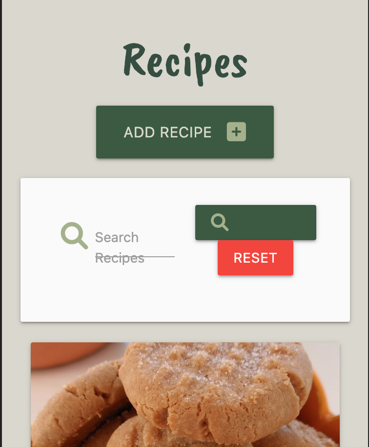

# **Testing** 
## **Validation**

- ### **HTML Files**
    I validated the HTML code using W3 Validation Service. The results can be seen below:
    - **home.html & base.html** 
    - **recipes**
    - **login**
    - **register**
    - **profile**
    - **add recipe** 
    - **edit recipe** 
    - **add category** 
    - **edit cateogry** 
- ### **CSS**
    The [W3C CSS Validator](https://jigsaw.w3.org/css-validator/) was used to test the style.css file.
        

- ### **JavaScript**
  [JSHint Validator](https://jshint.com/) was used to validate the JavaScript file.
  

- ### **Python**
  - [PEP8 Online](http://pep8online.com/) validator was used to test the routes.py file.
  

## **Testing User Stories**
 - **First-time user**
      - Be able to understand the purpose of the site easily
        -  The landing page greets users with a welcome message introducing the site.
      
      - Be able to easily navigate throughout the site
        - The navbar is accessible throughout the site with clearly named links.
        - The navbar options change depending on whether a user is logged in or not.
        - The navbar changes to a sidenav on smaller screens.
           
           
      - Experience good responsive design when accessing the site from different devices
        - The site looks good on all screen sizes
        
      - Access recipes without having to create an account
        - All recipes can be viewed by users, logged-in or not. 
      - Access a variety of vegetarian & vegan recipes for different meals of the day
        
      - Be able to filter recipes by ingredient and recipe title
        - The search bar allows users to search with the title or ingredients
         
      - Have the option to register an account
        - The option to register is available to all users that are not currently logged in. The register page is clearly labelled on the navbar. 
         
    - **Returning User**
      - Be able to login to their account
        - Users that have an existing account can select the login page and login into their account.
         
      - Share their own recipes
        - Once a user has logged in they can click the 'Add recipe button' and submit their own recipes. There are two 'Add Recipe' buttons. One is placed on the Profile page and the second one is on the recipes page.  
      - Find the recipes they have shared on their profile page
        - Once the user is logged in, the profile button is displayed on their navbar and they can access their profile where they can find the recipes they have shared
      - Edit the recipes they have added 
        - An edit button appears on the recipe card if the logged in user is the user who shared the recipe 
      - Delete the recipes they have added
        - A delete button appears on the recipe card if the logged in user is the user who shared the recipe  
    - **Admin**
      - Be able to add new recipes.
        - The admin user can add recipes by clicking on the 'Add Recipe' button on the profile page 
        - The admin user can add recipes by clicking on the 'Add Recipe' button on the recipe page 
      - Be able to edit recipes created by users
        - When the admin user accesses the recipe page, all recipe cards have an edit button
      - Be able to delete existing recipes created by any user.
         - When the admin user accesses the recipe page, all recipe cards have a delete button
  

## **Responsiveness**
The site was tested using [Mobile Compatibility Tester - Google Mobile Friendly Test](https://search.google.com/test/mobile-friendly) and [Google Chrome Developer Tools](https://developer.chrome.com/docs/devtools/). The site was also tested using the the following devices 

- Dell XPS 15 9520 Laptop
- MacBook Pro 2015
- Xiaomi Redmi Note 10 Pro

It works well on all screens. The following issues were found:
1. Search bar on small screens
- The word 'Search' is not displayed on the green search button (button still works as intended).
  - Search Recipes is displayed on 2 lines 
 
2. Recipe Card display 
   - When setting the width between 1095 and 993 the edit and delete recipe buttons cover the 'created by: user' on the recipe cards
  

## **Browser Compatibility**
The following browsers were tested:
| Browser        | Outcome       | 
| -------------  | ------------- | 
| Google Chrome  | Good          | 
| Mozilla-Firefox| Good          | 
| Safari         | Good          | 
| Edge           | Good          | 
| IE             | Poor          | 

All browsers, except IE, returned good results when displaying the site.

Compatibility issues with IE:
- SideNav does not work
- Main font does not work
- Does not render some of the images

## **Performance**
[Google Lighthouse](https://chrome.google.com/webstore/detail/lighthouse/blipmdconlkpinefehnmjammfjpmpbjk?hl=en) was used to test performance site. 
Overall the site performs well on desktop. For mobile devices the site performs well but has scored lower on performance, primarily due to large media content.
- Desktop 
- Mobile 

## **Manual Testing**
Throughout development, manual testing was carried out in addition to further testing at the end of the project. Testing was carried out on Google Chrome.

- Navigation links take users to the relevant pages
  - All links have been tested and work as intended 
  
- Brand logo takes users back to the home page

- Recipes Page
  - Displays all recipes. 
  - If a user is logged in they can see an 'Add Recipe' button 
  - When a user clicks on the image of a recipe a modal opens, which displays the full recipe
  - Users can close the modal either by clicking on the close button or by clicking outside the modal
  - Users can see an edit and delete button only for their own recipes
    - Both buttons have been tested and work as intended 
  - Admin user can see an edit and delete button on all recipe cards
  - Search bar allows users to input word search recipe titles and ingredients 
    - Reset button is required to be clicked in order to reset the search and display all recipes
    - When a user clicks the search button without typing anything, a message pops up asking the user to fill in the field

- Add Recipe 
  - The form has labels and prompts where required, guiding the user on how to fill the form out.
  - Validation was not added on 'Ingredients' and 'Method Steps'. All other inputs are validated 
  
- Edit Recipe
  - The edit recipe form is displayed retrieving all recipe details from the database

- Profile Page
  - Displays all recipes shared by the logged-in user
  - Add recipe button tested and it takes you to the add recipe form
  - Logout button tested and works as intended  
  
- Register Form
  - Form is validated and highlights to the user what is required if not filled in correctly

- Login Form
  - Existing users can log in
  - If unsuccessful a flash message will appear prompting users that the password and or username is incorrect

## **Bugs**
### **Found and Fixed**
**Category Display**
- I was having trouble displaying the recipe category for each recipe. The bug was caused as the categories were saved in PostgreSQL and the recipe on Mongo. The 'Add recipe' form retrieves the 'category_name' and displays from PSQL however it saves the 'category_id' on MongoDB. The issue was solved by moving the loop from the html file to the python function. See code bellow:
- 
- 
  
**Python validation errors:**
- Initially it came back with errors relating to trailing whitespace, lines too long and incorrect indentation.
- This was resolved and the validation came back with no errors.

### **Unfixed**
**Add Recipe Validation**
- Users can submit a recipe leaving the 'ingredients' and 'methods' empty. This is something that I did not have the time to fix before submitting the project.

